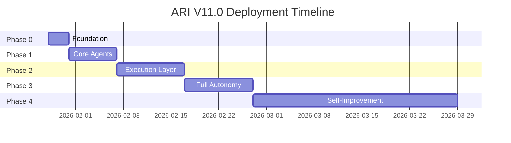

# ARI V11.0 ROADMAP
## Phased Delivery Plan | Mac Mini Deployment

---

## EXECUTIVE SUMMARY

This roadmap outlines the phased implementation of ARI V11.0, from initial deployment through full autonomous operation with self-improvement capabilities. Each phase builds upon the previous, ensuring stability before adding complexity.

**Target Platform:** Mac mini (M-series, 16GB+ RAM)
**Deployment Date:** January 28, 2026
**Full Production:** Q1 2026

---

## PHASE 0: FOUNDATION (Day 1-3)
### "Safe Ground"

**Objective:** Establish secure, auditable base system

#### Deliverables
- [x] Core documentation complete
- [x] Security policies defined
- [x] Governance framework established
- [x] Memory schema implemented
- [x] Logging infrastructure ready

#### Tasks
| Task | Owner | Status | Priority |
|------|-------|--------|----------|
| Deploy Mac mini hardware | Operator | Pending | CRITICAL |
| Install base dependencies | Operator | Pending | CRITICAL |
| Clone repository | Operator | Pending | CRITICAL |
| Initialize database | Bootstrap | Pending | CRITICAL |
| Verify logging works | Ops | Pending | HIGH |
| Run security test suite | Security | Pending | HIGH |
| Confirm backup system | Ops | Pending | HIGH |

#### Success Criteria
- [ ] System boots without errors
- [ ] Logs are being written correctly
- [ ] Database initialized with schema
- [ ] Backup job configured and tested
- [ ] Health check endpoint responds

#### Risk Mitigations
| Risk | Mitigation |
|------|------------|
| Hardware failure | Cloud backup ready |
| Config errors | Default safe config fallback |
| Network issues | Offline mode supported |

---

## PHASE 1: CORE AGENTS (Day 4-10)
### "First Breath"

**Objective:** Activate essential agent subsystem with human-in-the-loop

#### Agents Activated
```
Priority 1 (Day 4-5):
├── Router 🔀 - Request classification
├── Guardian 🛡️ - Trust sanitization
└── Arbiter 👑 - Decision authority

Priority 2 (Day 6-7):
├── Overseer 👁️ - Quality control
├── Strategy 📊 - Priority setting
└── Pipeline 📋 - State tracking

Priority 3 (Day 8-10):
├── Learning 📚 - Pattern capture
└── Memory Manager - Persistence
```

#### Deliverables
- [ ] Agent prompt files deployed
- [ ] Routing logic tested
- [ ] Trust boundary enforcement verified
- [ ] Approval flow functional
- [ ] Basic memory operations working

#### Tasks
| Task | Owner | Status | ETA |
|------|-------|--------|-----|
| Deploy Router prompt | Dev | Pending | Day 4 |
| Test routing accuracy | QA | Pending | Day 4 |
| Deploy Guardian | Security | Pending | Day 5 |
| Injection test suite | Security | Pending | Day 5 |
| Deploy Arbiter | Governance | Pending | Day 5 |
| Test escalation flow | QA | Pending | Day 6 |
| Deploy Overseer | Quality | Pending | Day 6 |
| Deploy Strategic tier | Dev | Pending | Day 7 |
| Integration testing | QA | Pending | Day 8-10 |

#### Success Criteria
- [ ] Router correctly classifies 95%+ of requests
- [ ] Guardian blocks all injection test cases
- [ ] Arbiter renders decisions within framework
- [ ] Overseer catches quality issues
- [ ] Memory writes include provenance

#### Approval Gates
- **Gate 1.1:** Security review of Guardian (Day 5)
- **Gate 1.2:** Governance review of Arbiter (Day 6)
- **Gate 1.3:** Integration sign-off (Day 10)

---

## PHASE 2: EXECUTION LAYER (Day 11-20)
### "Hands On"

**Objective:** Enable domain-specific execution with tool access

#### Agents Activated
```
Domain Specialists:
├── Research 🔍 - Intelligence gathering
├── Marketing ✉️ - Outreach creation
├── Sales 💼 - Deal handling
├── Content 📱 - Social/brand
├── SEO 🔎 - Visibility
├── Build 🏗️ - Specifications
├── Development 💻 - Code execution
└── Client Comms 📧 - Relationship mgmt
```

#### Tool Categories Enabled
| Category | Permission | Approval |
|----------|------------|----------|
| File Read | READ_ONLY | Automatic |
| Web Search | READ_ONLY | Automatic |
| File Write (workspace) | WRITE_SAFE | Automatic |
| Memory Write | WRITE_SAFE | Automatic |
| Email Send | WRITE_DESTRUCTIVE | Required |
| Git Push | WRITE_DESTRUCTIVE | Required |
| Deploy | WRITE_DESTRUCTIVE | Required |
| Shell Execute | ADMIN | Council Vote |

#### Deliverables
- [ ] All 8 domain agents deployed
- [ ] Tool wrappers implemented
- [ ] Permission tiers enforced
- [ ] Approval UI functional
- [ ] Audit logging complete

#### Tasks
| Task | Owner | Status | ETA |
|------|-------|--------|-----|
| Deploy Research agent | Dev | Pending | Day 11 |
| Deploy Marketing agent | Dev | Pending | Day 12 |
| Deploy Sales agent | Dev | Pending | Day 12 |
| Deploy Content agent | Dev | Pending | Day 13 |
| Deploy SEO agent | Dev | Pending | Day 13 |
| Deploy Build agent | Dev | Pending | Day 14 |
| Deploy Development agent | Dev | Pending | Day 14 |
| Deploy Client Comms | Dev | Pending | Day 15 |
| Implement tool wrappers | Dev | Pending | Day 16-17 |
| Permission testing | Security | Pending | Day 18 |
| End-to-end workflows | QA | Pending | Day 19-20 |

#### Success Criteria
- [ ] Each agent handles domain requests correctly
- [ ] Tools respect permission boundaries
- [ ] Destructive actions require approval
- [ ] Full audit trail for all tool calls
- [ ] Handoffs between agents work smoothly

#### Approval Gates
- **Gate 2.1:** Tool permission review (Day 17)
- **Gate 2.2:** Workflow validation (Day 19)
- **Gate 2.3:** Security penetration test (Day 20)

---

## PHASE 3: FULL AUTONOMY (Day 21-30)
### "Self-Sufficient"

**Objective:** Enable autonomous operation with minimal intervention

#### Capabilities Unlocked
```
Autonomous Operations:
├── Proactive monitoring
├── Self-healing (within bounds)
├── Automatic backups
├── Pattern-based learning
├── Performance optimization
└── Anomaly detection

Still Requires Approval:
├── Policy changes
├── New tool access
├── Memory schema changes
├── External communications
└── Financial decisions
```

#### Deliverables
- [ ] Monitoring dashboard
- [ ] Alert system configured
- [ ] Auto-recovery procedures
- [ ] Learning loop active
- [ ] Performance baselines set

#### Tasks
| Task | Owner | Status | ETA |
|------|-------|--------|-----|
| Implement health monitors | Ops | Pending | Day 21 |
| Configure alerting | Ops | Pending | Day 22 |
| Build recovery procedures | Ops | Pending | Day 23-24 |
| Enable learning loop | Dev | Pending | Day 25 |
| Performance tuning | Ops | Pending | Day 26-27 |
| Stress testing | QA | Pending | Day 28 |
| Documentation review | All | Pending | Day 29 |
| Final sign-off | Arbiter | Pending | Day 30 |

#### Success Criteria
- [ ] System runs 24h without intervention
- [ ] Alerts fire correctly on issues
- [ ] Recovery procedures tested
- [ ] Learning captures useful patterns
- [ ] Performance meets targets

#### Approval Gates
- **Gate 3.1:** Ops readiness review (Day 24)
- **Gate 3.2:** Learning loop safety (Day 26)
- **Gate 3.3:** Production sign-off (Day 30)

---

## PHASE 4: SELF-IMPROVEMENT (Month 2+)
### "Growing Smarter"

**Objective:** Enable controlled self-improvement with governance

#### Capabilities (Governance-Gated)
```
ALLOWED (Automatic):
├── Pattern recognition
├── Playbook optimization
├── Response time improvement
├── Error rate reduction
└── Resource efficiency

ALLOWED (Council Vote):
├── New pattern adoption
├── Playbook additions
├── Workflow modifications
└── Tool suggestions

NEVER ALLOWED:
├── Permission tier changes
├── Kernel modifications
├── Governance rule changes
├── Trust boundary changes
└── Self-approval mechanisms
```

#### Self-Improvement Protocol
```
1. Learning 📚 identifies improvement opportunity
2. Guardian 🛡️ validates safety
3. Strategy 📊 evaluates priority
4. Council votes (if governance change)
5. Arbiter 👑 approves
6. Change implemented
7. Monitoring period (7 days)
8. Permanent adoption or rollback
```

#### Deliverables
- [ ] Improvement proposal system
- [ ] A/B testing framework
- [ ] Rollback mechanisms
- [ ] Improvement audit trail
- [ ] Success metrics tracking

#### Success Criteria
- [ ] Improvements measurably beneficial
- [ ] No governance violations
- [ ] All changes reversible
- [ ] Audit trail complete
- [ ] Operator satisfied

---

## MILESTONE SUMMARY



| Phase | Start | End | Duration | Key Deliverable |
|-------|-------|-----|----------|-----------------|
| 0 | Day 1 | Day 3 | 3 days | Secure foundation |
| 1 | Day 4 | Day 10 | 7 days | Core agents active |
| 2 | Day 11 | Day 20 | 10 days | Full execution |
| 3 | Day 21 | Day 30 | 10 days | Autonomous ops |
| 4 | Month 2+ | Ongoing | Continuous | Self-improvement |

---

## RISK REGISTER

| Risk | Probability | Impact | Mitigation | Owner |
|------|-------------|--------|------------|-------|
| Hardware failure | Low | High | Cloud backup, spare parts | Ops |
| Security breach | Low | Critical | Defense in depth, monitoring | Security |
| Agent misbehavior | Medium | Medium | Governance gates, rollback | Governance |
| Performance issues | Medium | Medium | Monitoring, optimization | Ops |
| Data loss | Low | High | Automated backups, replication | Ops |
| Scope creep | High | Medium | Strict phase gates | PM |

---

## DECISION LOG

| Date | Decision | Rationale | Status |
|------|----------|-----------|--------|
| 2026-01-26 | SQLite for MVP | Simplicity, single-user | Accepted |
| 2026-01-26 | 13-agent council | Comprehensive coverage | Accepted |
| 2026-01-26 | Prompt-based agents | Flexibility, rapid iteration | Accepted |
| TBD | Multi-user support | Pending Phase 4 evaluation | Pending |

---

## SUCCESS METRICS

### Phase Completion Criteria

| Phase | Metric | Target |
|-------|--------|--------|
| 0 | System uptime | 99.9% |
| 1 | Routing accuracy | 95%+ |
| 2 | Tool compliance | 100% |
| 3 | Autonomous hours | 24h+ |
| 4 | Improvement rate | 1%/week |

### Overall Health Indicators

| Indicator | Green | Yellow | Red |
|-----------|-------|--------|-----|
| Response time | <2s | 2-5s | >5s |
| Error rate | <1% | 1-5% | >5% |
| Memory usage | <70% | 70-85% | >85% |
| Disk usage | <80% | 80-90% | >90% |
| Queue depth | <10 | 10-50 | >50 |

---

## NEXT STEPS

### Immediate (Before Tuesday)
1. [ ] Complete all documentation files
2. [ ] Run full Council review
3. [ ] Obtain Arbiter sign-off
4. [ ] Prepare deployment checklist
5. [ ] Test backup/restore procedures

### Day 1 (Tuesday)
1. [ ] Unbox and setup Mac mini
2. [ ] Install dependencies
3. [ ] Clone repository
4. [ ] Run bootstrap script
5. [ ] Verify system health

### Week 1
1. [ ] Complete Phase 0
2. [ ] Begin Phase 1
3. [ ] Daily health checks
4. [ ] Document any issues

---

**Document Version:** 1.0
**Last Updated:** January 26, 2026
**Status:** ACTIVE
**Owner:** Strategy 📊
