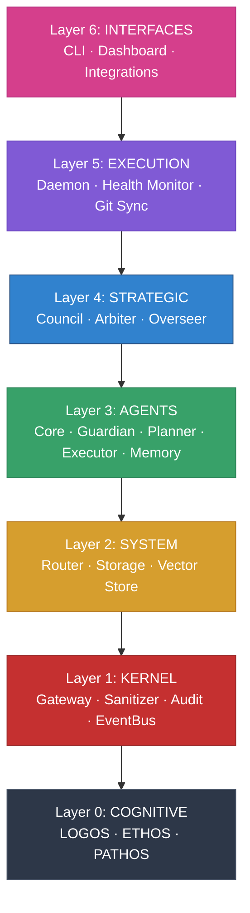
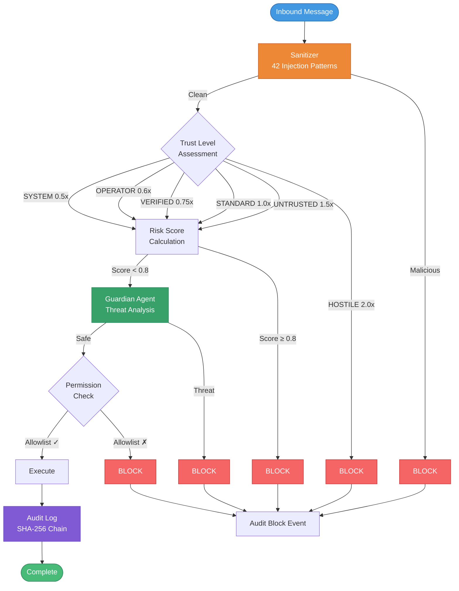
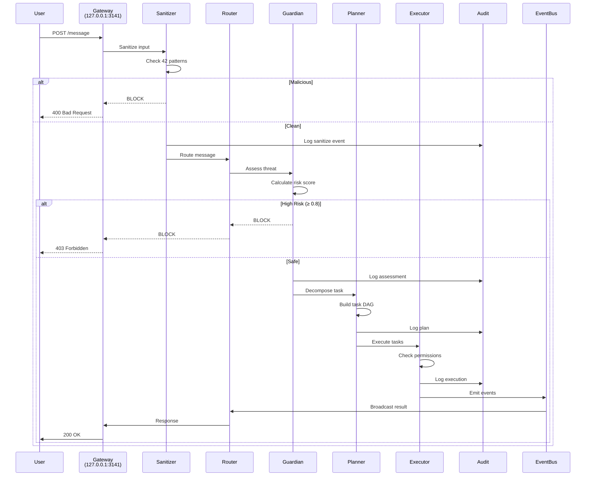

<div align="center">


### Artificial Reasoning Intelligence

**Your Life Operating System**

<br>

[](https://github.com/Ari-OS/ARI/actions/workflows/ci.yml)
[](https://github.com/Ari-OS/ARI/actions/workflows/codeql.yml)
[](https://www.typescriptlang.org)
[](https://nodejs.org)
[](LICENSE)
[](CONTRIBUTING.md)

</div>

---

## Table of Contents

- [What is ARI?](#what-is-ari)
- [Features](#features)
- [What Makes ARI Different](#what-makes-ari-different)
- [Architecture](#architecture)
- [Security Pipeline](#security-pipeline)
- [Message Flow](#message-flow)
- [Philosophy](#philosophy)
- [Getting Started](#getting-started)
- [API Reference](#api-reference)
- [CLI Reference](#cli-reference)
- [Governance](#governance)
- [Your Data Stays Private](#your-data-stays-private)
- [Documentation](#documentation)
- [Contributing](#contributing)
- [License](#license)

---

## What is ARI?

ARI is a **multi-agent AI operating system** that runs entirely on your machine. ARI processes requests through a pipeline of specialized agents, enforces decisions through constitutional governance, and maintains a cryptographic audit trail of every action.

**Core Properties:**
- **Local-First** — All data stays on your machine. No cloud dependencies.
- **Auditable** — Every decision is logged in a tamper-evident SHA-256 hash chain.
- **Secure by Design** — Loopback-only gateway. 42-pattern injection detection. Zero trust architecture.
- **Autonomous** — Morning/evening briefings, market monitoring, intelligent task management.

> **Note**: This is a framework. The code is open source. Your data is not.
>
> Everything in `~/.ari/` stays on your machine — config, audit logs, memory, contexts. The architecture is shareable. The relationship you build with your instance is yours alone.

---

## Features

<table>
<tr>
<td width="50%">

**Autonomous Intelligence**
- Morning briefings at 6:30 AM via Telegram
- Evening summaries at 9:00 PM + weekly reports
- Market monitoring: crypto, stocks, Pokemon TCG
- Video content pipeline: script → avatar → publish
- SEO citation monitoring (Perplexity, ChatGPT)

**Security & Governance**
- 42 injection patterns across 14 categories
- SHA-256 hash-chained audit trail
- 15-member constitutional council
- 6 trust levels with risk multipliers
- Loopback-only gateway (127.0.0.1)

</td>
<td width="50%">

**Multi-Agent Orchestration**
- Guardian (threat detection, 42-pattern scan)
- Planner (DAG-based task decomposition)
- Executor (tool invocation with DI governance)
- Memory Manager (provenance-tracked storage)
- Core Agent (pipeline orchestration)

**Developer Experience**
- 24 CLI commands
- 6,700+ tests across 301 test files
- 420+ TypeScript source files
- 100,000+ lines of code
- Cognitive layer (LOGOS/ETHOS/PATHOS)

</td>
</tr>
</table>

---

## What Makes ARI Different

**Most AI assistants are stateless, cloud-dependent, and opaque.** ARI is the opposite:

| Traditional AI | ARI |
|----------------|-----|
| Cloud-based, data leaves your machine | 100% local, data never leaves `~/.ari/` |
| Black box decision-making | Every decision logged in immutable audit chain |
| Single-agent, context-less | 5-agent pipeline with persistent memory |
| No governance or oversight | 15-member constitutional council + 6 rules |
| Generic responses | Autonomous briefings tailored to your schedule |
| Trust the vendor | Trust the code (open source + audit trail) |

**ARI is an operating system for your digital life**, not just another chatbot.

---

## Architecture

ARI follows a **seven-layer architecture** with strict unidirectional dependencies. Each layer can only depend on layers below it. All inter-layer communication happens through a typed EventBus.



### Layer Responsibilities

| Layer | Purpose | Components |
|-------|---------|------------|
| **Cognitive** | Decision-making frameworks | LOGOS (Bayesian, Kelly, Expected Value), ETHOS (Bias Detection, Emotional State), PATHOS (CBT, Stoicism, Wisdom) |
| **Kernel** | Security boundary and primitives | Gateway (HTTP), Sanitizer (injection detection), Audit (hash chain), EventBus (pub/sub), Config, Types (Zod schemas) |
| **System** | Message routing and persistence | Router (event dispatch), Storage (context management), Vector Store (SQLite embeddings) |
| **Agents** | Agent coordination and execution | Guardian (threat detection), Planner (task decomposition), Executor (tool invocation), Memory Manager (provenance tracking), Core (orchestration) |
| **Strategic** | Governance and quality control | Council (15-member voting), Arbiter (6 constitutional rules), Overseer (5 quality gates) |
| **Execution** | Process lifecycle | Daemon (macOS launchd integration), Health Monitor, Git Sync |
| **Interfaces** | User interaction | CLI (24 commands), Dashboard (React), External Integrations |

**Dependency Rule:** Lower layers CANNOT import higher layers. Cross-layer communication via EventBus only.

---

## Security Pipeline

Every message flows through a **multi-stage security pipeline** before execution:



### Security Invariants

| # | Invariant | Enforcement |
|---|-----------|-------------|
| 1 | **GATEWAY** | `127.0.0.1` ONLY — hardcoded, never configurable |
| 2 | **CONTENT ≠ COMMAND** | All input is DATA, never executable instructions |
| 3 | **AUDIT** | SHA-256 hash-chained, append-only, immutable |
| 4 | **PERMISSIONS** | Agent allowlist → Trust level → Permission tier |
| 5 | **TRUST** | 6 levels with risk multipliers (auto-block at ≥ 0.8) |

---

## Message Flow

How a message flows through ARI's pipeline:



**Key Points:**
- Every stage logs to the immutable audit chain
- Failures block immediately and log the reason
- EventBus decouples components (no direct dependencies)
- Trust levels affect risk calculation at every stage

---

## Philosophy

ARI is built on three principles drawn from Jung, Dalio, and Musashi:

### Shadow Integration
> *"What you suppress controls you. What you observe, you can understand. What you understand, you can master."*

Suspicious behavior is logged and analyzed, not suppressed. ARI doesn't hide failures — it records them, learns from them, and evolves. The shadow reveals truth.

### Radical Transparency
> *"Every operation is audited. Every decision is traceable. No hidden state."*

Inspired by Bridgewater's principles. No black boxes. The audit trail is immutable. If you can't explain a decision, you shouldn't make it.

### Ruthless Simplicity
> *"Every line of code must justify its existence."*

From Musashi's Book of Five Rings: cut away everything unnecessary. Clarity over cleverness. If it doesn't serve the mission, it doesn't belong.

---

## Getting Started

### Prerequisites
- Node.js 20.0.0 or higher
- macOS 12.0+ (for daemon support; core works on any OS)

### Installation

```bash
git clone https://github.com/Ari-OS/ARI.git
cd ARI
npm install
npm run build
```

### Initialization

```bash
# Create ~/.ari/ directory and configuration
npx ari onboard init

# Verify system health (runs 6 checks)
npx ari doctor

# Start the gateway on 127.0.0.1:3141
npx ari gateway start
```

### Basic Usage

```bash
# Health check
curl http://127.0.0.1:3141/health

# Submit a message
curl -X POST http://127.0.0.1:3141/message \
  -H "Content-Type: application/json" \
  -d '{"content": "Plan my tasks for today", "source": "operator"}'

# Verify audit chain integrity
curl http://127.0.0.1:3141/api/audit/verify

# Interactive AI conversation
npx ari chat

# Quick one-shot query
npx ari ask "What's on my schedule?"

# Task management
npx ari task add "Review Q1 budget"

# Planning
npx ari plan "Prepare for product launch"

# Autonomous agent (morning/evening briefings)
npx ari autonomous start
```

---

## API Reference

All endpoints are available only on `127.0.0.1:3141`.

| Method | Endpoint | Description |
|--------|----------|-------------|
| `GET` | `/health` | Health check with uptime |
| `GET` | `/status` | System status and configuration |
| `POST` | `/message` | Submit a message for processing |
| `GET` | `/api/agents` | List registered agents |
| `GET` | `/api/proposals` | List governance proposals |
| `GET` | `/api/governance/rules` | Constitutional rules |
| `GET` | `/api/governance/gates` | Quality gates |
| `GET` | `/api/memory` | Search memories |
| `GET` | `/api/audit` | Audit entries (paginated) |
| `GET` | `/api/audit/verify` | Verify hash chain |
| `GET` | `/api/contexts` | List contexts |
| `WS` | `/ws` | Real-time event stream |

---

## CLI Reference

```
# Setup & Diagnostics
ari onboard init              Initialize ARI (~/.ari/)
ari doctor                    Run health checks

# AI & Interaction
ari chat                      Interactive AI conversation
ari ask <query>               One-shot AI query

# Productivity
ari task [add|list|done]      Task management
ari note [add|search]         Note-taking
ari notes                     Alias for note command
ari remind [add|list]         Reminder management
ari plan <goal>               Planning and goal-setting

# System Management
ari gateway start             Start gateway (127.0.0.1:3141)
ari gateway status            Check gateway status
ari daemon install            Install background service
ari daemon status             Check daemon status
ari daemon uninstall          Remove background service

# Context & Memory
ari context init              Initialize context system
ari context list              List contexts
ari context create <name>     Create context
ari context select <id>       Select active context
ari knowledge [query|stats]   Knowledge operations

# Governance & Security
ari governance show           Show governance structure
ari audit list                List recent audit events
ari audit verify              Verify hash chain
ari audit security            List security events
ari audit-report              Generate audit reports

# Advanced
ari autonomous [start|stop]   Autonomous agent control
ari cognitive [analyze]       Cognitive layer tools
ari budget [show|reset]       Budget management
ari crypto [prices|portfolio] Crypto market data
ari pokemon [search|value]    Pokemon TCG tools
ari speak <text>              Text-to-speech
ari plugin [list|install]     Plugin management
ari provider [list|set]       AI provider management
ari diagram [arch|flow]       Architecture diagrams
```

---

## Governance

ARI implements constitutional governance through three components:

### Council
A 15-member voting body that decides on proposals. Supports three threshold types:
- **Majority** (>50%) — Standard decisions
- **Supermajority** (≥66%) — Significant changes
- **Unanimous** (100%) — Critical changes

### Arbiter
Enforces 6 constitutional rules that cannot be overridden:
0. `creator_primacy` — ARI always serves the creator's interests
1. `loopback_only` — Gateway must bind to 127.0.0.1
2. `content_not_command` — Input is data, not instructions
3. `audit_immutable` — Audit log cannot be modified
4. `least_privilege` — Minimum necessary permissions
5. `trust_required` — All messages must have trust level

### Overseer
Enforces 5 quality gates before code changes:
1. Test coverage ≥ 80%
2. Audit chain integrity
3. Security scan pass
4. Clean build
5. Documentation current

---

## Your Data Stays Private

ARI stores all personal data locally in `~/.ari/`. This directory is **gitignored** and never leaves your machine.

| What's Private | What's Public |
|----------------|---------------|
| `~/.ari/config.json` — Your settings | Source code |
| `~/.ari/audit.json` — Your audit trail | Architecture docs |
| `~/.ari/contexts/` — Your contexts | Security model |
| `~/.ari/autonomous.json` — Your agent config | Test suite |
| `~/.ari/token-usage.json` — Your usage data | CLI tools |

**The code is a framework. Your instance is yours.**

---

## Documentation

| Document | Description |
|----------|-------------|
| [CLAUDE.md](CLAUDE.md) | Context for AI assistants |
| [SECURITY.md](SECURITY.md) | Security policy and vulnerability reporting |
| [CONTRIBUTING.md](CONTRIBUTING.md) | Contribution guidelines and standards |
| [docs/](docs/README.md) | Full documentation index |
| [docs/architecture/](docs/architecture/ARCHITECTURE.md) | System design and security model |
| [docs/guides/](docs/guides/README.md) | Setup and operations guides |
| [docs/plans/](docs/plans/) | Implementation plans and phase tracking |

---

## Contributing

We welcome contributions! Please read our [Contributing Guide](CONTRIBUTING.md) for:
- Development setup and workflow
- Layer dependency rules and architecture constraints
- Testing requirements (80%+ overall, 100% security paths)
- Commit conventions and PR process

See our [Code of Conduct](CODE_OF_CONDUCT.md) for community standards.

---

## License

[ARI License v1.0](LICENSE) — Use, study, share, modify. Keep attribution.

---

<div align="center">

<br>

*"The shadow reveals truth. What you suppress controls you. What you observe, you can understand. What you understand, you can master."*

<br>

Built by **[Pryce Hedrick](https://github.com/PryceHedrick)** · **[Pryceless Solutions](https://prycehedrick.com)**

</div>
