<div align="center">


### Artificial Reasoning Intelligence

**Your Personal AI Operating System**

<br>

[](https://github.com/Ari-OS/ARI/actions/workflows/ci.yml)
[](https://github.com/Ari-OS/ARI/actions/workflows/codeql.yml)
[](https://www.typescriptlang.org)
[](https://nodejs.org)
[](tests/)
[](LICENSE)

</div>

---

## What is ARI?

ARI is a **multi-agent AI operating system** that runs entirely on your machine. Six specialized agents work together — coordinated by ARI as the orchestrator — to run your business pipelines, monitor markets, generate content, and deliver daily intelligence briefings. Every action is logged in a tamper-evident SHA-256 hash chain. Nothing leaves `~/.ari/`.

**Core Properties:**

- **Local-First** — All data stays on your machine. No cloud dependencies.
- **Six Named Agents** — ARI 🧠, NOVA 🎬, CHASE 🎯, PULSE 📡, DEX 🗂️, RUNE 🔧. Each has a defined role, model, and plane.
- **Auditable** — Every decision logged in an immutable SHA-256 hash chain.
- **Secure by Design** — Loopback-only gateway. 63-pattern injection detection. Zero trust architecture.
- **Autonomous** — 24 scheduled tasks: briefings, market monitoring, content pipelines, lead discovery.
- **OpenClaw Plugin Runtime** — 13 plugins powering every capability. Hot-reloadable. Hook-based architecture.

> **Note**: This is a framework. The code is open source. Your data is not.
>
> Everything in `~/.ari/` stays on your machine — config, audit logs, memory, agent contexts. The architecture is shareable. The relationship you build with your instance is yours alone.

---

## The Agent Team

Six named agents. Two context planes. One orchestrator.

| Agent | Role | Model | Plane | Discord |
|-------|------|-------|-------|---------|
| **ARI 🧠** | CFO / Orchestrator | claude-opus-4-6 | APEX | #ari-main, #ari-deep |
| **NOVA 🎬** | P1 Content Creator | claude-sonnet-4-6 | APEX | #paytheprice-main, #video-queue |
| **CHASE 🎯** | P2 Lead Connector | claude-sonnet-4-6 | APEX | #leads, #outreach-queue |
| **PULSE 📡** | Market Analyst | claude-haiku-4-5 | APEX | #market-alerts, #pokemon-market |
| **DEX 🗂️** | Research Scout | claude-haiku-4-5 | APEX | #research-digest |
| **RUNE 🔧** | Engineering Builder | claude-sonnet-4-6 | CODEX | (isolated — no business context) |

**Two Context Planes:**

- **APEX** — Full business context. ARI, NOVA, CHASE, PULSE, DEX receive SOUL.md, USER.md, GOALS.md, HEARTBEAT.md, and real-time market/pipeline state.
- **CODEX** — Engineering isolation. RUNE receives only the task spec and AGENTS.md. No personal data, no pipeline state, no SOUL files. Enforced in code — violations throw immediately.

**ARI's Role:** Orchestrator only. She plans, prioritizes, and coordinates. She never builds, verifies, or codes inline. Subagents execute.

---

## Business Pipelines

### P1 — PayThePryce (NOVA 🎬)

YouTube content pipeline for the Pokemon TCG market.

```
PULSE detects price spike → writes market signal to shared state
  ↓
NOVA reads signal → Haiku draft → Sonnet polish → confidence gate (≥0.95)
  ↓
Rights gate (every asset needs commercial_ok clearance)
  ↓
Thumbnail generation: Ideogram V3 (Fal.ai) + DALL-E 3 → 4 variants → #thumbnail-lab
  ↓
Pryce selects A/B/C/D thumbnail → video posted to #video-queue (48h TTL)
  ↓
Pryce clicks ✅ → NOVA uploads to YouTube
```

NOVA runs automatically at 10 AM daily scanning for price moves ≥15% over 7 days. Script confidence must reach 0.95 before advancing. Every claim has an evidenceId. NOVA never fabricates market data and never auto-publishes.

### P2 — Pryceless Solutions (CHASE 🎯)

Indiana B2B lead discovery and outreach pipeline.

```
CHASE discovers Indiana businesses (SerpAPI + Google Business Profile)
  ↓
5-criteria website audit: SEO + Contact + Presence + CTA + Business Signals
  ↓
Minimum score 40/100 to proceed. Below 40 → cold bucket silently.
  ↓
3-phase LLM qualification: Hot ≥75 | Warm 50-75 | Cold <50
  ↓
Prompt Forge 4-pass lock: Evidence → Offer → Critic → Lock (SHA-256, 7-day TTL)
  ↓
Demo site built showing the business what their improved site looks like
  ↓
Outreach draft → #outreach-queue for Pryce approval (OPERATOR-ONLY, 72h TTL)
```

CHASE runs Monday, Wednesday, and Friday automatically. He never sends outreach without an explicit slash command. Every outreach message leads with one specific verified fact about the business.

---

## Architecture

ARI follows a **seven-layer architecture** with strict unidirectional dependencies. Each layer can only import layers below it. All cross-layer communication goes through a typed EventBus (ADR-003).

```mermaid
graph TB
    L6[Layer 6: INTERFACES<br/>CLI · Dashboard · Integrations]
    L5[Layer 5: EXECUTION<br/>Daemon · Health Monitor · Git Sync]
    L4[Layer 4: STRATEGIC<br/>Council · Arbiter · Overseer]
    L3[Layer 3: AGENTS<br/>Core · Guardian · Planner · Executor · Memory]
    L2[Layer 2: SYSTEM<br/>Router · Storage · Vector Store]
    L1[Layer 1: KERNEL<br/>Gateway · Sanitizer · Audit · EventBus]
    L0[Layer 0: COGNITIVE<br/>LOGOS · ETHOS · PATHOS]

    L6 --> L5
    L5 --> L4
    L4 --> L3
    L3 --> L2
    L2 --> L1
    L1 --> L0

    style L0 fill:#2d3748,stroke:#4a5568,color:#fff
    style L1 fill:#c53030,stroke:#9b2c2c,color:#fff
    style L2 fill:#d69e2e,stroke:#b7791f,color:#fff
    style L3 fill:#38a169,stroke:#2f855a,color:#fff
    style L4 fill:#3182ce,stroke:#2c5282,color:#fff
    style L5 fill:#805ad5,stroke:#6b46c1,color:#fff
    style L6 fill:#d53f8c,stroke:#b83280,color:#fff
```



### Layer Responsibilities

| Layer | Purpose | Components |
|-------|---------|------------|
| **Cognitive** | Decision-making frameworks | LOGOS (Bayesian, Kelly, EV), ETHOS (Bias Detection), PATHOS (Growth Framing) |
| **Kernel** | Security boundary | Gateway (HTTP), Sanitizer (63 patterns), Audit (hash chain), EventBus, Zod types |
| **System** | Message routing & persistence | Router, Storage, SQLite WAL |
| **Agents** | Internal pipeline | Guardian (threat detection), Planner (DAG), Executor (tool invocation), Memory, Core |
| **Strategic** | Governance | Council (15-member voting), Arbiter (6 constitutional rules), Overseer (5 quality gates) |
| **Execution** | Process lifecycle | Daemon (macOS launchd), Health Monitor |
| **Interfaces** | User interaction | CLI (24 commands), Dashboard, External Integrations |

**Dependency Rule:** Lower layers CANNOT import higher layers. Cross-layer communication via EventBus only.

---

## OpenClaw Plugin System

ARI's capabilities are delivered through **13 OpenClaw plugins** — a hook-based plugin runtime that powers every agent and pipeline:

| Plugin | Purpose |
|--------|---------|
| `ari-kernel` | 63-pattern sanitizer, trust multipliers, config validation, API key format enforcement |
| `ari-ai` | ValueScore model routing across 4 providers (Anthropic, OpenRouter, Perplexity, Google) |
| `ari-agents` | Named agent registry, APEX/CODEX plane enforcement, capability card coordination |
| `ari-workspace` | Context bundle assembly, SOUL file loading, plane validation |
| `ari-scheduler` | 24 cron tasks (Eastern Time), task lifecycle, priority queuing |
| `ari-briefings` | Morning/workday/evening briefings with Ralph quality loops |
| `ari-market` | Market monitoring, Z-score anomaly detection, PULSE formatting |
| `ari-memory` | SQLite WAL + TF-IDF search, SHA-256 dedup, bookmark pipeline |
| `ari-cognitive` | LOGOS/ETHOS/PATHOS prompt framework, synthesis output |
| `ari-voice` | ElevenLabs TTS, OGG Vorbis, Discord multipart delivery |
| `ari-governance` | 3-gate approval system (auto / approval-required / operator-only) |
| `ari-autonomous` | Discord command bridge, approval button routing |
| `ari-notion` | Workspace files + SQLite (Notion integration deferred) |

---

## Security Pipeline

Every message flows through a **multi-stage security pipeline** before execution:


### Security Invariants

| # | Invariant | Enforcement |
|---|-----------|------------|
| 1 | **GATEWAY** | `127.0.0.1` ONLY — hardcoded, never configurable |
| 2 | **CONTENT ≠ COMMAND** | All input is DATA, never executable instructions |
| 3 | **AUDIT** | SHA-256 hash-chained, append-only, immutable |
| 4 | **PERMISSIONS** | Agent allowlist → Trust level → Permission tier |
| 5 | **TRUST** | 6 levels with risk multipliers (auto-block at ≥ 0.8) |

### Locked ADRs

| ADR | Decision |
|-----|---------|
| 001 | Loopback-only gateway — `127.0.0.1`, never configurable |
| 002 | SHA-256 hash chain audit — append-only, tamper-evident |
| 003 | EventBus single coupling point — no direct cross-layer imports |
| 004 | Seven-layer architecture — strict unidirectional dependencies |
| 005 | Content ≠ Command — all input treated as data |
| 006 | Zod for all runtime validation |
| 007 | Vitest for all tests |
| 008 | macOS-first (Phase 1-3) |
| 009 | EventBus typed events with payload validation |
| 010 | SQLite WAL mode for all local databases |
| 011 | execFileNoThrow for all subprocess calls |
| 012 | Eastern Time for all cron schedules |
| 014 | Video approval gate — never auto-publish |

---

## Governance

### 3-Gate Approval System

All ARI actions route through exactly one gate. Zero exceptions.

| Gate | Who Approves | Examples |
|------|-------------|---------|
| **auto** | ARI (logged + traced) | Health checks, market scans, research, memory dedup |
| **approval-required** | Pryce via Discord ✅/❌ | Video upload, outreach draft, social post |
| **operator-only** | Pryce via explicit slash command | DELETE operations, data wipe, irreversible actions |

**Decision framework:**
1. Reversible AND internal? → `auto`
2. Public-facing OR external comms? → `approval-required`
3. Irreversible (delete/wipe/transfer)? → `operator-only`
4. Security event? → `operator-only` + immediate Discord alert

**TTL rules:** Video approvals expire 48h. Outreach approvals expire 72h. Expired = auto-declined, requeued.

### Constitutional Governance

- **Council** — 15-member voting body. Majority (>50%), Supermajority (≥66%), Unanimous (100%).
- **Arbiter** — Enforces 6 constitutional rules that cannot be overridden: `creator_primacy`, `loopback_only`, `content_not_command`, `audit_immutable`, `least_privilege`, `trust_required`.
- **Overseer** — 5 quality gates before any code change: coverage ≥80%, audit integrity, security scan, clean build, documentation current.

---

## Getting Started

### Prerequisites

- Node.js 20.0.0 or higher
- macOS 12.0+ (for daemon support; core works on any OS)

### Installation

```bash
git clone https://github.com/Ari-OS/ARI.git
cd ARI
npm install
npm run build
```

### Initialization

```bash
# Create ~/.ari/ directory and configuration
npx ari onboard init

# Verify system health (runs 6 checks)
npx ari doctor

# Start the gateway on 127.0.0.1:3141
npx ari gateway start
```

### Basic Usage

```bash
# Health check
curl http://127.0.0.1:3141/health

# Submit a message
curl -X POST http://127.0.0.1:3141/message \
  -H "Content-Type: application/json" \
  -d '{"content": "Plan my tasks for today", "source": "operator"}'

# Verify audit chain integrity
curl http://127.0.0.1:3141/api/audit/verify

# Interactive AI conversation
npx ari chat

# Quick one-shot query
npx ari ask "What's on my schedule?"

# Autonomous agent (morning/evening briefings + 24 scheduled tasks)
npx ari autonomous start
```

---

## What Makes ARI Different

**Most AI assistants are stateless, cloud-dependent, and opaque.** ARI is the opposite:

| Traditional AI | ARI |
|---------------|-----|
| Cloud-based, data leaves your machine | 100% local, data never leaves `~/.ari/` |
| Black box decision-making | Every decision logged in immutable audit chain |
| Single-agent, context-less | 6 named agents with persistent memory and SOUL files |
| No governance or oversight | 3-gate approval system + constitutional council |
| Generic responses | Autonomous briefings tailored to your schedule |
| Trust the vendor | Trust the code (open source + audit trail) |
| One capability | Full business pipelines: content + leads + market intel |

---

## API Reference

All endpoints available only on `127.0.0.1:3141`.

| Method | Endpoint | Description |
|--------|---------|-------------|
| `GET` | `/health` | Health check with uptime |
| `GET` | `/status` | System status and configuration |
| `POST` | `/message` | Submit a message for processing |
| `GET` | `/api/agents` | List registered agents |
| `GET` | `/api/proposals` | List governance proposals |
| `GET` | `/api/governance/rules` | Constitutional rules |
| `GET` | `/api/governance/gates` | Quality gates |
| `GET` | `/api/memory` | Search memories |
| `GET` | `/api/audit` | Audit entries (paginated) |
| `GET` | `/api/audit/verify` | Verify hash chain |
| `GET` | `/api/contexts` | List contexts |
| `WS` | `/ws` | Real-time event stream |

---

## CLI Reference

```
# Setup & Diagnostics
ari onboard init              Initialize ARI (~/.ari/)
ari doctor                    Run health checks

# AI & Interaction
ari chat                      Interactive AI conversation
ari ask <query>               One-shot AI query

# Productivity
ari task [add|list|done]      Task management
ari note [add|search]         Note-taking
ari remind [add|list]         Reminder management
ari plan <goal>               Planning and goal-setting

# System Management
ari gateway start             Start gateway (127.0.0.1:3141)
ari gateway status            Check gateway status
ari daemon install            Install background service
ari daemon status             Check daemon status
ari daemon uninstall          Remove background service

# Context & Memory
ari context init              Initialize context system
ari context list              List contexts
ari context create <name>     Create context
ari context select <id>       Select active context
ari knowledge [query|stats]   Knowledge operations

# Governance & Security
ari governance show           Show governance structure
ari audit list                List recent audit events
ari audit verify              Verify hash chain
ari audit security            List security events
ari audit-report              Generate audit reports

# Advanced
ari autonomous [start|stop]   Autonomous agent control
ari cognitive [analyze]       Cognitive layer tools
ari budget [show|reset]       Budget management
ari crypto [prices|portfolio] Crypto market data
ari pokemon [search|value]    Pokemon TCG tools
ari speak <text>              Text-to-speech
ari plugin [list|install]     Plugin management
ari provider [list|set]       AI provider management
ari diagram [arch|flow]       Architecture diagrams
```

---

## Philosophy

ARI is built on three principles drawn from Jung, Dalio, and Musashi:

### Shadow Integration

> _"What you suppress controls you. What you observe, you can understand. What you understand, you can master."_

Suspicious behavior is logged and analyzed, not suppressed. ARI doesn't hide failures — she records them, learns from them, and evolves. The shadow reveals truth.

### Radical Transparency

> _"Every operation is audited. Every decision is traceable. No hidden state."_

Inspired by Bridgewater's principles. No black boxes. The audit trail is immutable. If you can't explain a decision, you shouldn't make it.

### Ruthless Simplicity

> _"Every line of code must justify its existence."_

From Musashi's Book of Five Rings: cut away everything unnecessary. Clarity over cleverness. If it doesn't serve the mission, it doesn't belong.

---

## Your Data Stays Private

ARI stores all personal data locally in `~/.ari/`. This directory is **gitignored** and never leaves your machine.

| What's Private | What's Public |
|---------------|--------------|
| `~/.ari/config.json` — Your settings | Source code |
| `~/.ari/audit.json` — Your audit trail | Architecture docs |
| `~/.ari/workspace/` — Agent identity files | Security model |
| `~/.ari/databases/` — SQLite memory | Test suite |
| `~/.ari/contexts/` — Your contexts | CLI tools |

**The code is a framework. Your instance is yours.**

---

## Documentation

| Document | Description |
|---------|-------------|
| [CLAUDE.md](CLAUDE.md) | Context for AI assistants working in this repo |
| [SECURITY.md](SECURITY.md) | Security policy and vulnerability reporting |
| [CONTRIBUTING.md](CONTRIBUTING.md) | Contribution guidelines and standards |
| [docs/](docs/README.md) | Full documentation index |
| [docs/architecture/](docs/architecture/ARCHITECTURE.md) | System design and security model |
| [docs/guides/](docs/guides/README.md) | Setup and operations guides |

---

## Contributing

Contributions are welcome. Please read [CONTRIBUTING.md](CONTRIBUTING.md) for:

- Development setup and workflow
- Layer dependency rules and architecture constraints
- Testing requirements (80%+ overall, 100% security paths)
- Commit conventions and PR process

---

## License

[ARI License v1.0](LICENSE) — Use, study, share, modify. Keep attribution.

---

<div align="center">

<br>

_"The shadow reveals truth. What you suppress controls you. What you observe, you can understand. What you understand, you can master."_

<br>

Built by **[0xPryce](https://github.com/PryceHedrick)** · **[Pryceless Solutions](https://prycehedrick.com)**

</div>
