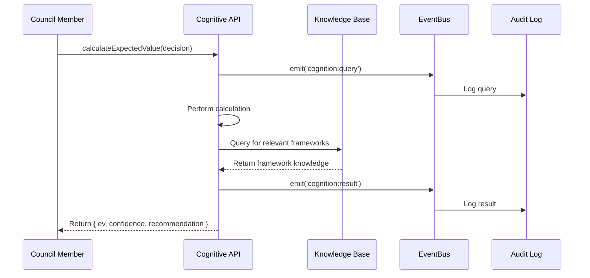

# Cognitive Layer 0: Architecture Diagrams

**Version**: 1.0.0  
**Date**: 2026-02-01

---

## Layer 0 in ARI Architecture

```mermaid
graph TB
    subgraph Layer6 [Layer 6: INTERFACES]
        CLI[CLI Commands]
        Dashboard[Dashboard UI]
    end
    
    subgraph Layer5 [Layer 5: EXECUTION]
        Daemon[Daemon]
        Tasks[Background Tasks]
    end
    
    subgraph Layer4 [Layer 4: STRATEGIC]
        Council[Council 15 Members]
        Arbiter[Arbiter]
        Overseer[Overseer]
    end
    
    subgraph Layer3 [Layer 3: CORE AGENTS]
        Core[Core Orchestrator]
        Guardian[Guardian]
        Planner[Planner]
        Executor[Executor]
    end
    
    subgraph Layer2 [Layer 2: SYSTEM]
        Router[Router]
        Storage[Storage]
        Context[Context]
    end
    
    subgraph Layer1 [Layer 1: KERNEL]
        Gateway[Gateway]
        Sanitizer[Sanitizer]
        Audit[Audit Chain]
        EventBus[EventBus]
    end
    
    subgraph Layer0 [Layer 0: COGNITIVE - NEW]
        LOGOS[LOGOS - Reason]
        ETHOS[ETHOS - Character]
        PATHOS[PATHOS - Growth]
    end
    
    subgraph Knowledge [Knowledge Streams]
        Sources[87 Curated Sources]
    end
    
    Layer6 --> Layer5
    Layer5 --> Layer4
    Layer4 --> Layer3
    Layer3 --> Layer2
    Layer2 --> Layer1
    Layer1 --> Layer0
    
    Sources --> Layer0
    
    style Layer0 fill:#4a1a4a,stroke:#9333ea,stroke-width:3px
    style LOGOS fill:#1e3a8a,stroke:#3b82f6
    style ETHOS fill:#7c2d12,stroke:#f97316
    style PATHOS fill:#134e4a,stroke:#10b981
```

---

## Cognitive API Flow

---

## Learning Loop Diagram

```mermaid
graph LR
    Stage1[1. Performance Review<br/>Daily 9PM]
    Stage2[2. Gap Analysis<br/>Weekly Sunday]
    Stage3[3. Source Discovery<br/>As Needed]
    Stage4[4. Knowledge Integration<br/>Daily 8AM]
    Stage5[5. Self-Assessment<br/>Monthly 1st]
    
    Stage1 --> Stage2
    Stage2 --> Stage3
    Stage3 -->|Human Approval| Stage4
    Stage4 --> Stage1
    Stage2 --> Stage5
    Stage5 -.->|Feedback| Stage1
    
    style Stage1 fill:#1e3a8a
    style Stage2 fill:#7c2d12
    style Stage3 fill:#134e4a
    style Stage4 fill:#4a1a4a
    style Stage5 fill:#713f12
```

---

## Knowledge Validation Pipeline

```mermaid
graph TD
    Source[External Source]
    
    Source --> Stage1{Stage 1<br/>Whitelist?}
    Stage1 -->|Not Whitelisted| Reject1[Reject]
    Stage1 -->|Whitelisted| Stage2[Stage 2<br/>Sanitize]
    
    Stage2 --> CheckInj{Injection<br/>Patterns?}
    CheckInj -->|Detected| Reject2[Reject]
    CheckInj -->|Clean| Stage3[Stage 3<br/>Bias Detection]
    
    Stage3 --> CheckBias{Bias Score}
    CheckBias -->|"> 0.8 & UNTRUSTED"| Reject3[Reject]
    CheckBias -->|"> 0.8 & STANDARD"| FlagReview[Flag for Review]
    CheckBias -->|"< 0.8"| Stage4[Stage 4<br/>Fact Check]
    
    Stage4 --> CrossRef{Cross-Reference}
    CrossRef -->|Contradicted| FlagReview
    CrossRef -->|Supported| CheckTrust{Source Trust?}
    
    CheckTrust -->|VERIFIED| Integrate[Integrate]
    CheckTrust -->|STANDARD| Integrate
    CheckTrust -->|UNTRUSTED| Stage5[Stage 5<br/>Human Review]
    
    FlagReview --> Stage5
    Stage5 -->|Approved| Integrate
    Stage5 -->|Rejected| Reject4[Reject]
    
    Integrate --> Index[Index for Search]
    Index --> Available[Available to Council]
    
    style Source fill:#134e4a
    style Integrate fill:#4a1a4a
    style Available fill:#1e3a8a
```

---

## Council Specialization Map

| Pillar | Specialists (Primary Weight > 0.50) |
|--------|-------------------------------------|
| **LOGOS** | SCOUT (0.70), ATLAS (0.70), TRUE (0.75), BOLT (0.80), MINT (0.65), OPAL (0.65) |
| **ETHOS** | AEGIS (0.60), EMBER (0.60) |
| **PATHOS** | PULSE (0.60), BLOOM (0.65), VERA (0.50) |

**Balanced** (No dominant pillar): TEMPO, PRISM, NEXUS, ECHO

---

**Last Updated**: 2026-02-01  
**Total Documentation**: 350+ pages  
**Status**: Design complete, ready for implementation
